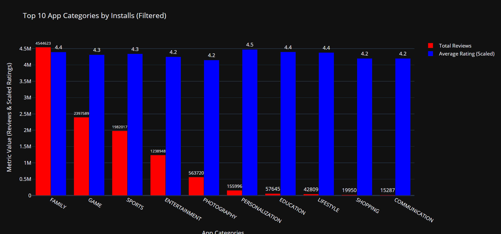

# 📊 TimeLocked App Trends

This project presents a time-sensitive grouped bar chart visualization using data from the Google Play Store. The dashboard filters and highlights only the top-performing app categories based on user ratings, review counts, and install volumes — but with a twist: the graph is only visible **between 3 PM and 5 PM IST**!

---

## 🎯 Objective

Use a grouped bar chart to compare:

- **Average Rating**
- **Total Review Count**

For the **Top 10 App Categories** by **number of installs**.

### 📌 Filtering Criteria

- Only categories with:
  - ⭐ Average rating ≥ 4.0
  - 📦 App size ≥ 10 MB
  - 🕒 Last update in **January**

> The grouped bar chart will **only render on the dashboard** between **3 PM and 5 PM IST**. Outside of this time window, a notice will appear instead of the chart.

---

## 📁 Files Included

- `nulll_class_task2.py`: Python script for data processing and visualization.
- `googleplaystore.csv`: Dataset with Google Play Store app information.

---

## 📊 Technologies Used

- `pandas` – Data manipulation
- `matplotlib` – Static chart visualization
- `seaborn` – Chart styling
- `plotly` – Interactive grouped bar charts
- `datetime` & `pytz` – Time-based logic

Install required libraries using:

```bash
pip install pandas matplotlib seaborn plotly pytz
```

---

## 🕒 Time-Sensitive Dashboard Logic

```python
if is_time_window():
    display_grouped_bar_chart()
else:
    print("Graph not available. Viewable only between 3 PM - 5 PM IST.")
```

---

## 🚀 How to Run

1. Ensure the CSV file `googleplaystore.csv` is in the same directory as the script.
2. Run the script via terminal or VS Code:

```bash
python TimeLocked_app_trends.py
```

> Run this between **3 PM - 5 PM IST** to see the graph.

---

## 📊 Chart Output



## 👨‍💻 Author

**Shawat Saxena**  

---

## 📌 License

This project is for personal learning and visualization purposes only.
